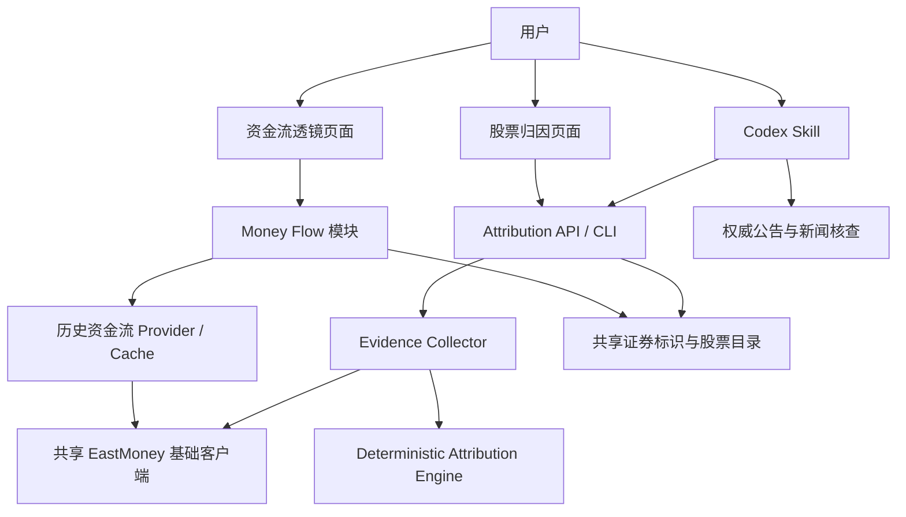

# A股研究工具箱产品 Roadmap

## 1. 文档目的

本文维护 `A股研究工具箱` 的产品方向、阶段目标和优先级。它覆盖整个工具箱，是未来规划的唯一入口；各模块计划只记录模块范围、已完成能力和实施历史，不重复维护跨模块优先级。

Roadmap 使用阶段而非承诺日期。进入下一阶段前，先满足上一阶段的完成标准。

## 2. 产品定位

`A股研究工具箱` 是本地部署、面向个人研究的 A 股工具集合。目前包含两个并列模块：

- `资金流透镜`：回答“股票或板块在指定区间内，资金如何流动”。
- `股票涨跌归因`：回答“股票在最新交易日为什么上涨或下跌”。

产品采用模块化单体：一个仓库、一个 Next.js 应用和一个 FastAPI 进程。模块之间共享中性的股票标识和数据访问基础设施，但不共享业务状态或业务规则。

## 3. 路线原则

1. 先保证数据可信、结论可解释，再增加分析数量。
2. 每个模块独立形成输入、处理、输出闭环，不把一个模块变成另一个模块的前置步骤。
3. 后端是业务规则的事实源；Web 和 Skill 只消费稳定契约。
4. 优先提升个人研究效率，不以行情终端、社交产品或交易系统为目标。
5. 暂不拆服务和仓库，只有明确的部署或团队边界出现后再评估。

## 4. 当前基线

### 已完成：资金流透镜 1A / 1B

- 股票代码和名称查询、多股票查询、日期区间查询。
- AKShare 与 EastMoney provider、SQLite 缓存和最近数据刷新。
- 查询历史、自选分组、行业及概念板块资金流。
- 区间汇总、每日明细、累计曲线、资金流图表、CSV 和 Excel 导出。
- 自动刷新能力，默认关闭并通过后端配置启用。

### 已完成：股票涨跌归因 1.0

- 独立 Web 入口 `/attribution`。
- 唯一接口 `POST /api/stock-move/attribution`。
- 最新交易日的市场、风格、行业、同行、个股资金流和公告证据。
- 三类驱动评分、一级驱动、置信度、反事实和数据警告。
- 后端归因引擎作为唯一规则源，并返回 `methodologyVersion`。
- 仓库内 `analyze-stock-move` Skill 通过 HTTP API 使用归因结果。

### 已完成：产品与架构解耦

- 中性应用壳统一为 `A股研究工具箱`。
- `/money-flow` 与 `/attribution` 为两个独立入口。
- FastAPI 内形成 `money_flow` 与 `stock_move_attribution` 两个业务模块。
- 资金流页面只能通过 `symbol` 导航到归因页面，不共享查询结果或页面状态。

## 5. 产品目标结构

这张图表达产品入口和能力边界：资金流透镜使用历史资金流与缓存形成独立查询闭环；股票归因页面和 Codex Skill 使用同一归因能力；Skill 可以在结构化归因之外继续核查权威公告与新闻。两个模块只复用数据访问、证券标识和股票目录等中性基础设施。

## 6. 路线图

### 阶段一：可靠性与可解释性

目标：让用户能判断数据是否完整、结论使用了什么规则，以及失败后如何处理。

候选事项：

- 统一展示数据源、数据日期、缓存状态和可用区间。
- 为上游空响应、字段变化、限流与传输降级补充可观测信息。
- 完善两个模块的关键用户链路回归验证。
- 建立归因方法版本的变更记录和兼容规则。
- 明确资金流统计口径、数据延迟和归因限制的页面提示。

完成标准：常见失败能够定位到输入、缓存、数据源或证据缺失；用户能从页面和文档确认数据时点与方法版本。

### 阶段二：研究效率

目标：减少重复查询和手工对比，让两个模块各自在自身边界内完成更高效的研究。

资金流候选事项：

- 个股多周期资金流对比。
- 行业、概念连续净流入排行。
- ETF / 指数查询能力；在实施前先确认数据源口径和证券标识模型。
- 可复用的研究视图或查询组合。

归因候选事项：

- 指定历史交易日归因；前提是证据可以按时点一致地回放。
- 归因结果导出或生成可分享报告。
- 在不复制后端规则的前提下，增强证据下钻与来源追踪。
- 对方法版本不同的归因结果进行明确标识。

完成标准：用户可以完成多周期或多对象对比，并能保存或导出研究结果；新增能力仍不引入跨模块业务状态依赖。

### 阶段三：持续跟踪与提醒

目标：从“用户主动查询”扩展到“系统发现值得关注的变化”。

候选事项：

- 资金流阈值提醒。
- 自选股资金流异动提醒。
- 行业或概念连续流入变化提醒。
- 本地通知；其他消息渠道在确有使用需求后评估。
- 提醒触发后跳转到对应模块，传递证券标识或查询条件，不直接生成未经验证的归因结论。

完成标准：提醒可配置、可关闭、可解释且不会重复轰炸；触发依据和数据时间清晰可见。

### 阶段四：策略验证

目标：在积累足够稳定、口径一致的历史数据后，验证资金流信号是否具有统计意义。

候选事项：

- 资金流与涨跌幅的联动分析。
- 基础策略回测。
- 交易成本、样本外验证和数据缺失处理。
- 方法与结果版本化，避免用当前可见数据污染历史判断。

进入条件：历史数据覆盖、复权口径、交易日历和数据质量已经能够支持可重复验证。未满足条件前，不把回测结果作为产品主结论。

## 7. 暂不纳入 Roadmap

- 微服务拆分、多仓库或复杂消息基础设施。
- 登录、多用户权限和云端协作。
- 实时盘口或 Level-2 行情终端。
- 自动下单和自动交易。
- 个性化买卖建议。
- 港股、美股等非 A 股市场。

这些事项只有在本地个人研究的产品定位发生变化后才重新评估。

## 8. 优先级判定

候选事项进入实施前，按以下顺序判断：

1. 是否提升现有结论的正确性、可解释性或故障恢复能力。
2. 是否解决高频、重复且可以明确验收的研究任务。
3. 是否能保持模块独立，不复制规则或形成隐式前置依赖。
4. 数据源是否支持稳定、合法且时点一致的数据。
5. 本地运行和维护成本是否与个人工具定位匹配。

若一项需求需要先改变产品定位、部署形态或数据口径，应先形成独立决策，不直接进入开发清单。

## 9. 文档分工

| 文档 | 责任 |
| --- | --- |
| `docs/product-roadmap.md` | 整个工具箱的方向、阶段和跨模块优先级 |
| `docs/资金流透镜 项目计划.md` | 资金流模块的范围、已完成情况和历史实施记录 |
| `docs/architecture.md` | 当前模块边界与依赖规则 |
| `docs/api.md` | 当前 HTTP 接口契约 |
| `docs/data-source.md` | 当前数据源、口径和降级限制 |

Roadmap 发生调整时，在本文更新阶段和优先级；已经实现的行为则同步到对应模块计划、API 或架构文档。
